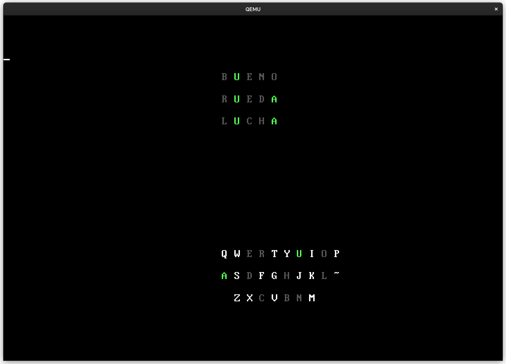

# WordleOS (ES)

This is Wordle implemented as a Multiboot application.
You load the executable file using GNU GRUB and you get a fullscreen Wordle
that run without an operating system.

So it is like... its own operating system I guess?

**Gringo alert**: it is using a Spanish dictionary. You have been warned.
The list of words comes from [wspanish](https://packages.debian.org/bullseye/wspanish).

## Why the code looks so weird?

I copied and pasted files from my other operating system repository,
[NativeOS](https://github.com/danirod/nativeos), so that I could re-use the
functions for drawing to the screen or reading from the keyboard. I just removed the main function and replaced it with a call to wordle() to start the game
but there are a lot of things that are part of the other kernel, such as a VFS (yes) and a lot of standard library functions that are not used.

That is why at the moment it looks like this. I only modified the files that I need to touch, so everything else
looks the same. I did not even rename the executable files or the
comments LUL.

The thing you are looking for is in the `wordle.c` file. I did this in a [livestream](https://twitch.tv/danirod_) in a couple hours so it is not the best quality and not the best commented code though. Please be considerate at me. I might cleanup this in the future. Or not.

To download a ISO, check the releases for an ISO that you can boot
in a virtual machine like QEMU, or in an old computer. I suspect this is
not going to work in EFI systems because I don't know EFI yet.

To build this, you are going to need clang. Might or might not work with GCC. Run:

- `make wordle.elf` to build the kernel as a multiboot file
- `make wordle.iso` to build the ISO file if you have grub-mkrescue installed
- `make qemu` to run the kernel in QEMU if you have qemu-system-i386 installed
